| Nama      | Shobahus Solichin |
| ----------- | ----------- |
| NIM     | 312010076       |
| Kelas   | TI.20.A.1        |

## Langkah langkah praktikum 3
Persiapan membuat dokumen HTML dengan nama file lab3_list.html seperti berikut.

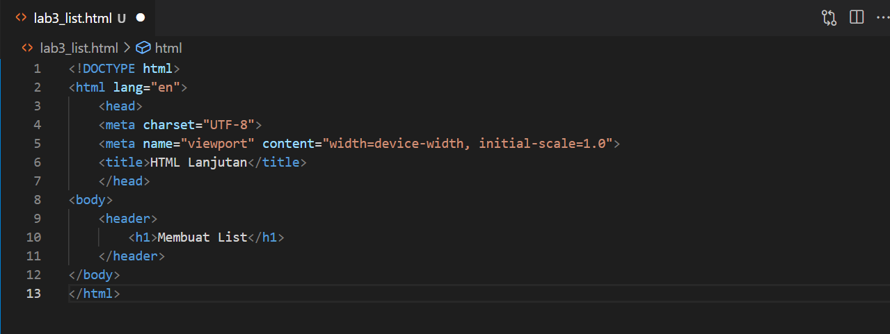

## Membuat Ordered List
Kemudian tambahkan kode untuk membuat Ordered List seperti berikut.

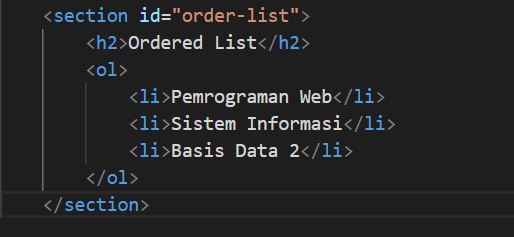

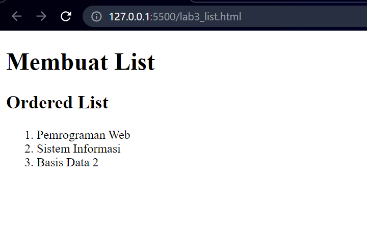

## Membuat Unorderd List
Kemudian tambakan kode untuk membuat Unordered List, setelah deklarasi ordered list pada section `unordered-list`, seperti berikut.

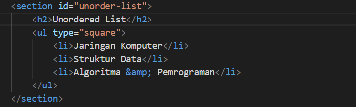

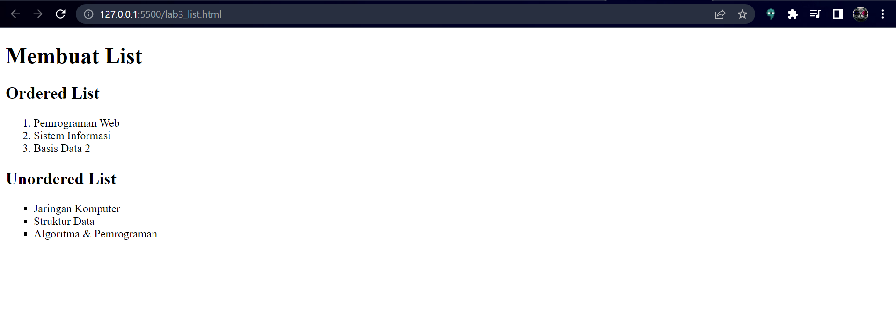

## Membuat Description List
Kemudian tambahkan kode untuk membuat description list setelah deklarasi unorderd-list.

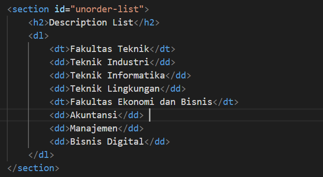

## Membuat Tabel
Buat file baru dengan nama lab3_tabel.html seperti berikut.

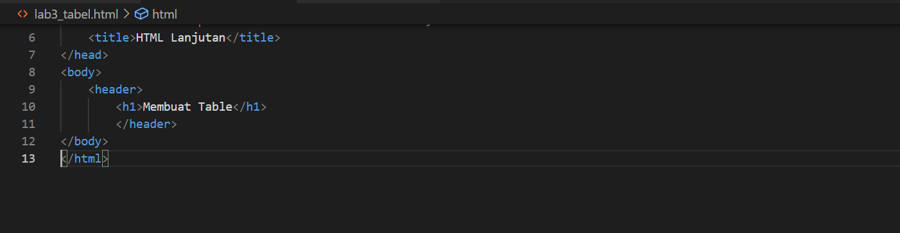

Kemudian selanjutnya tambahkan kode untuk membuat tabel sederhana seperti berikut:

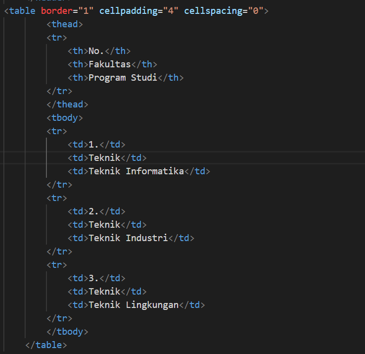

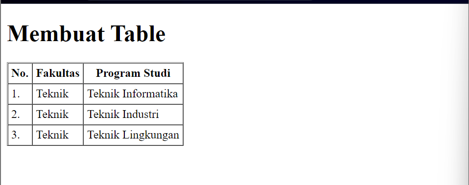

## Mengatur Margin dan Padding
Untuk mengatur margin dan padding pada cel data, tambahkan atribut `cellpadding` dan
`cellspacing` pada tag table.

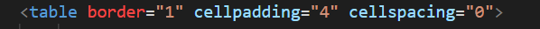

## Menggabungkan Sel Data
Untuk menggabungkan sel data, gunakan atribut rowspan dan colspan. Atribut rowspan untuk menggabungkan baris (secara vertikal) dan colspan untuk menggabungkan kolom (secara horizontal).

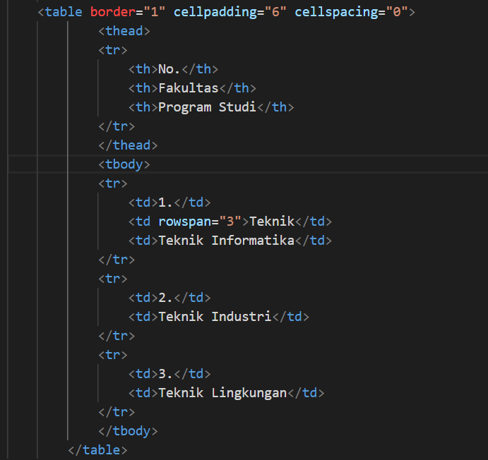

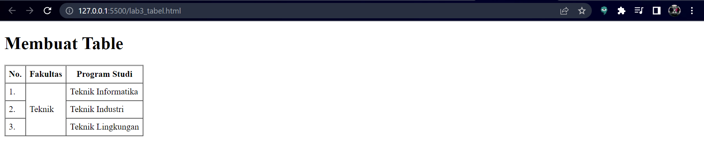

## Membuat Form
Buat file baru dengan nama lab3_form.html seperti berikut.

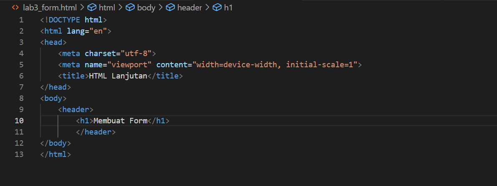

Kemudian selanjutnya tambahkan kode untuk membuat tabel sederhana seperti berikut:

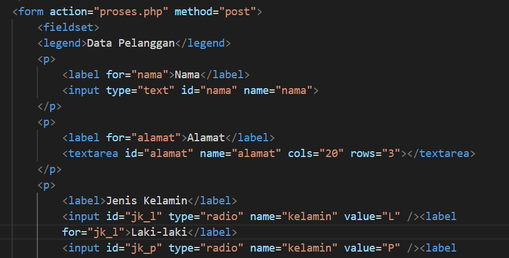

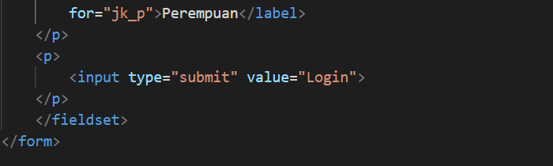

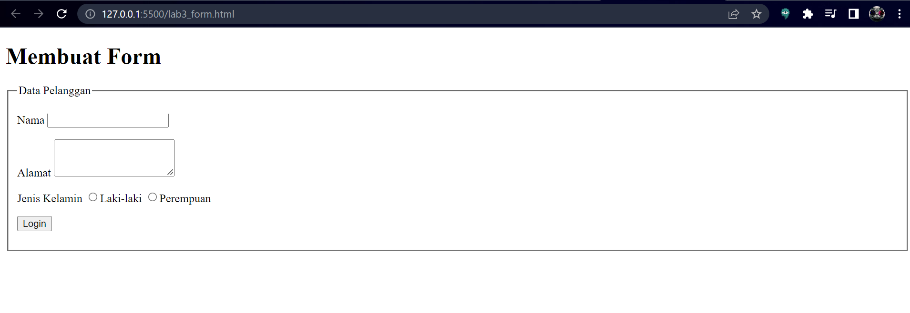

## Menambahkan Style pada Form
Agar tampilan form lebih menarik, bisa ditambahkan CSS seperti berikut.

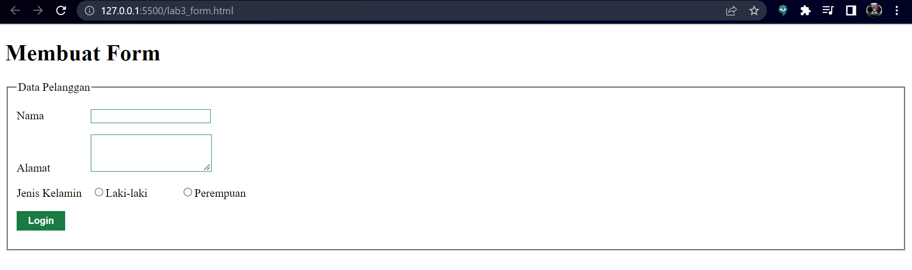

# Pertanyaan dan Tugas
1. Buatlah form yang menampilkan dropdown menu dan listbox dengan multiple selection.
## Jawab
1.HTML

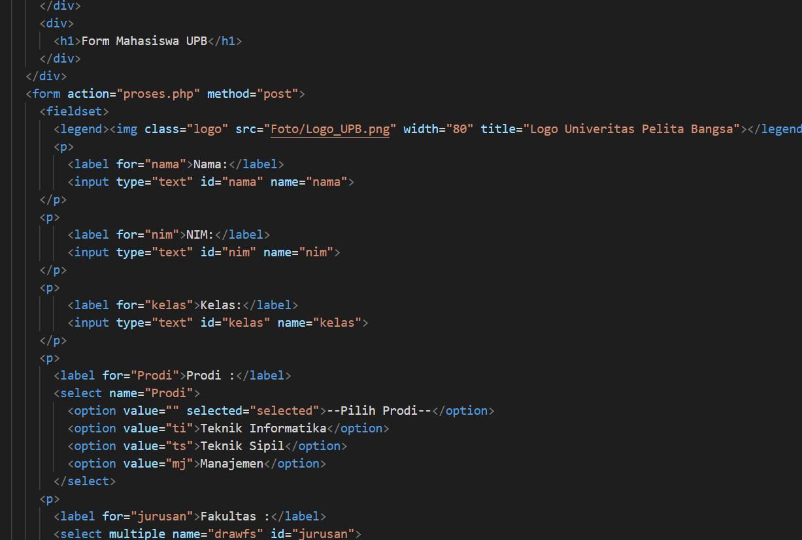

  CSS

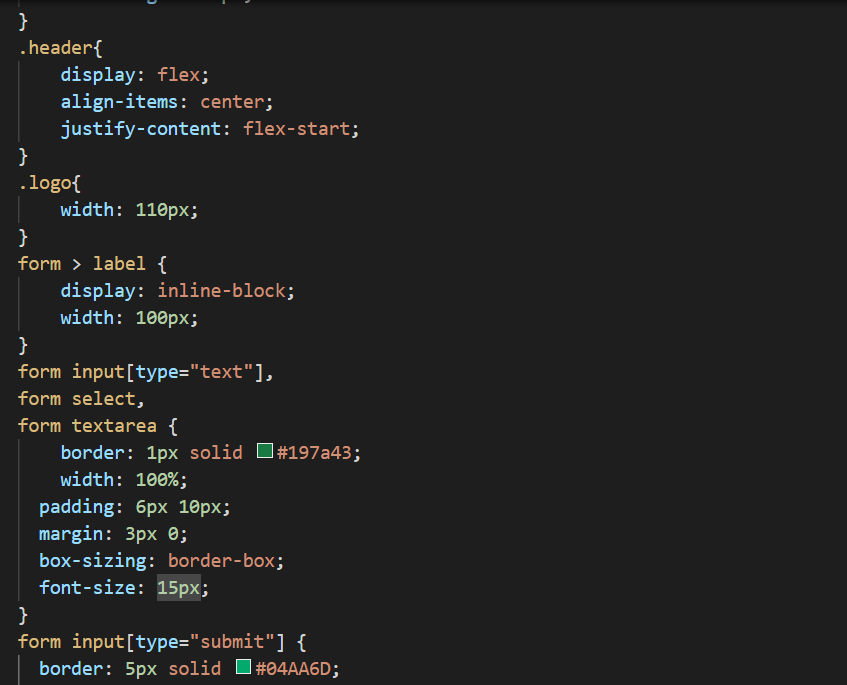

  OUTPUT

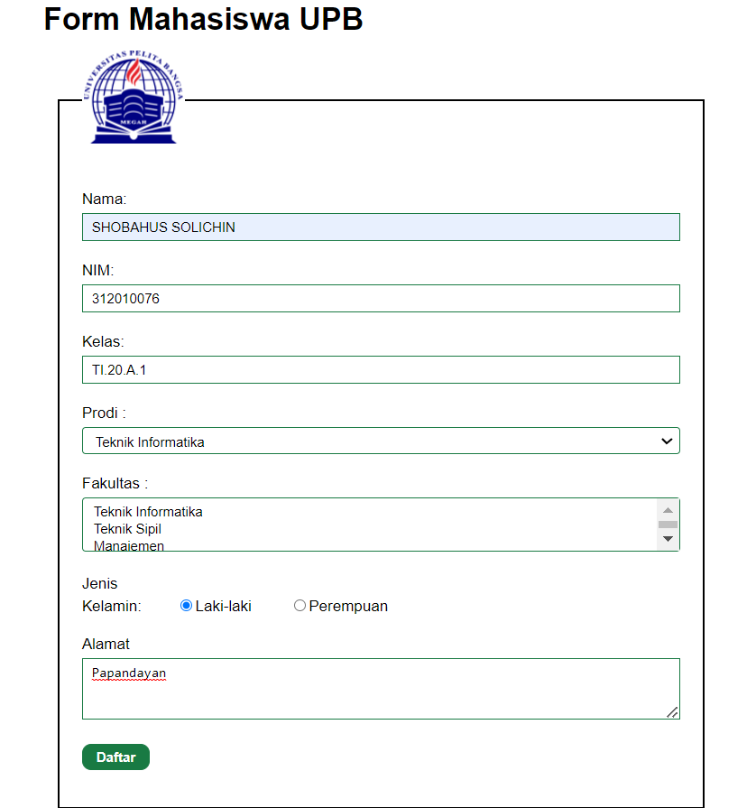
hddjdjjdjddd